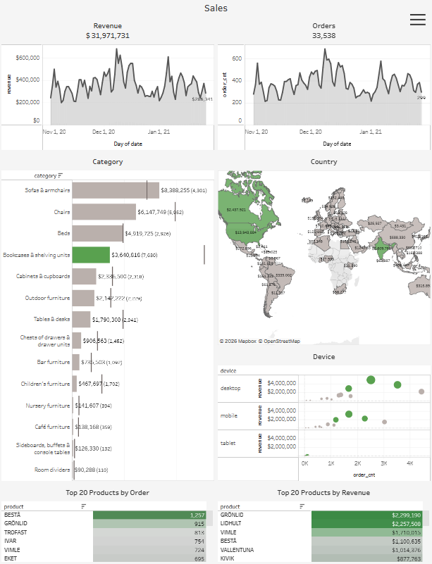

# SQL + Tableau | Sales Performance Analysis

## Short Summary

Interactive Tableau dashboard analyzing sales performance across time, product categories, countries, and devices.
The project focuses on revenue dynamics, order behavior, product contribution, and geographic distribution of sales.

## Project Overview

This project analyzes transactional sales data and presents key business metrics in an interactive Tableau dashboard.

The objective was to:

- Monitor revenue and order trends over time

- Identify top-performing product categories

- Compare geographic sales distribution

- Analyze device-level performance

- Detect high- and low-performing products

The dashboard enables multi-dimensional analysis using interactive filters and drill-down capabilities.

## Data Source & Data Model

The analysis is based on a relational database containing:

### Core Tables:

- `order`

- `session`

- `product`

- `session_params`

The data model connects transactional orders with session-level behavioral and geographic information.

### Data Granularity:
Aggregated at:

- `date`

- `country`

- `device`

- `category

- `product`

## Database Schema


## Data Preparation (SQL Layer)

The reporting dataset was created using the following :

Transformation Logic:

- Orders are linked to sessions via ga_session_id

- Product information is enriched through item_id

- Geographic and device attributes are added from session_params

- Revenue is calculated as the sum of product prices

- Order volume is calculated as the number of session-based transactions

This query generates a structured dataset ready for Tableau reporting and multi-dimensional analysis.

## Business Questions

- How does revenue change over time?

- Are revenue and order trends aligned?

- Which product categories generate the highest revenue?

- Which countries drive the largest sales volume?

- How does device usage affect revenue performance?

- Which products are leaders by orders vs revenue?

## Dashboard Overview



The dashboard includes:

 ### KPI & Time Series

- Total Revenue: $31,971,731

- Total Orders: 33,538

- Revenue trend over time

- Order trend over time

### Category Performance

- Revenue by product category

- Order count by category

- Category ranking by contribution

### Geographic Analysis

- Country-level revenue distribution

- Visual identification of core markets

### Device Analysis

- Revenue vs order count by device

- Desktop vs mobile performance comparison

### Product Ranking

- Top 20 products by order volume

- Top 20 products by revenue

- Identification of high-volume vs high-value SKUs

## Interactive Dashboard

  

[Open Dashboard on Tableau Public](https://public.tableau.com/shared/6K54D5RBK?:display_count=n&:origin=viz_share_link)

## Key Insights

- Revenue and order trends move consistently, indicating stable conversion patterns

- A small number of categories generate a disproportionate share of revenue

- Sales are geographically concentrated in specific European markets

- Desktop generates higher total revenue compared to mobile devices

- Some products rank high in order volume but lower in revenue, suggesting price positioning differences

## Tools & Technologies

- SQL (BigQuery syntax)

- Relational data modeling

- Aggregation & metric engineering

- Tableau Public

- KPI & performance analytics

## Repository Structure
```
sales-performance-analysis-dashboard-tableau/

README.md

sql/
  sales_aggregation_query.sql

docs/
  database_schema.png 

dashboard/
  sales_dashboard.twbx

screenshots/
  dashboard_preview.png
```
